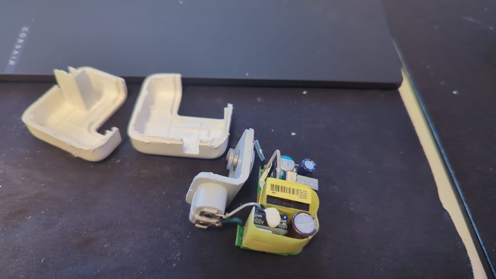
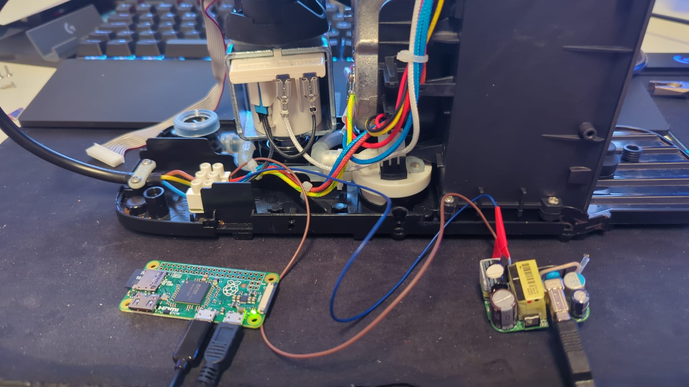
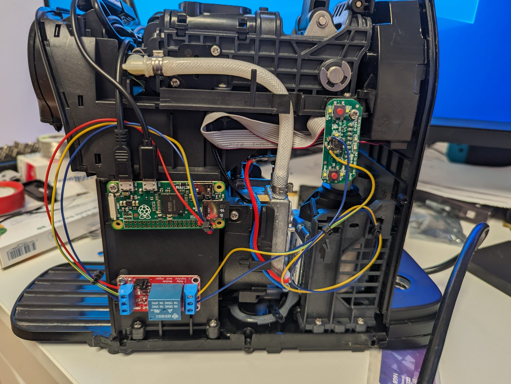

# ☕⏰ Coffee Alarm ⏰☕

An automated alarm, waking you up to the sweet sweet smell of coffee every morning, because coffee-addicts like me should not suffer the long minute in the morning until coffee is done... 

---

## Components

### Coffee maker

> [!CAUTION] 
> This project assumes, that keeping the Coffee-button pressed let's you control the flow.

I salvaged an old Nespresso machine and disassembled it. To harvest power for the raspberry pi I found, that Apples old chargers could easily be taken apart.



After connecting the charger's power wires to the coffee maker's internal power lines, the Raspberry Pi can be powered directly via a USB cable.



### Raspberry Pi
Once the Raspberry Pi is powered, the next step is to connect it to the coffee makers control buttons.

To achieve this, I utilized a 1-Channel 5V relay. This relay acts as an electronic switch, allowing the Raspberry Pi to simulate button presses.



> [!CAUTION] 
> This project explicitly uses **GPIO 17** for control, and this pin is hardcoded in multiple parts of the projects software.
> Pinouts: [pinout.xyz](https://pinout.xyz/)directly.

### Mobile App
The App was developed using Flutter and apart from setting the Alarm, it lets you control how many seconds the button is pressed for Coffee / Espresso. Also you can configure the IP-Address of the pi, I advise setting a static IP.

---

## Installation

### Raspberry Pi

Ensure the Raspberry Pi is connected to the internet.

1.  CLone this repository
    ```bash
    git clone https://github.com/LucaEggenberg/coffee_alarm.git
    ```

2.  Cd into the pi directory
    ```bash
    cd coffee_alarm/pi
    ```

3. Install the project
    ```bash
    make install
    ```

The API will be hosted on Port 8000. Swagger UI can be viewed on `http://localhost:8000/docs` (Or the Raspberry Pis IP address)

### Troubleshooting

* **API Logs:** Logs for the API service can be found in the systemd service: `coffee_alarm.api.service`.
* **Cronjob Logs:** Logs for the cron job are written to `/coffee/cronJob.log`.
* **Project Files:** The project files are installed under `/home/pi/coffee_alarm`. This is the location to modify log levels or make other direct code changes if needed.

## App
The Android APK can be found in the projects [Releases](https://github.com/LucaEggenberg/coffee_alarm/releases) section. Download and install it on your Android device.